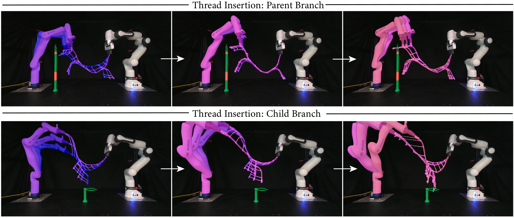
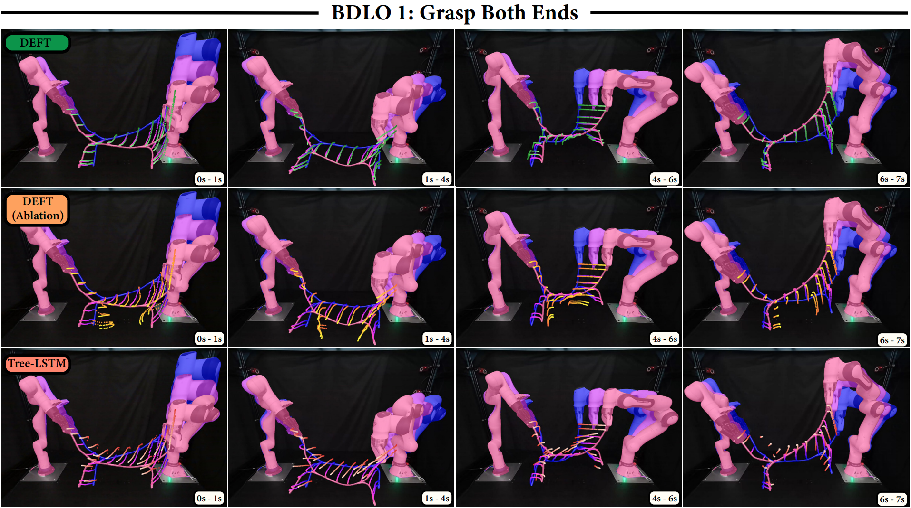
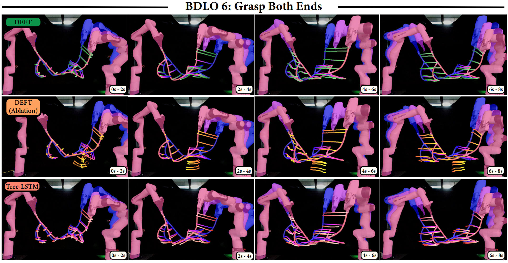

# DEFT: Differentiable Branched Discrete Elastic Rods for Modeling Furcated DLOs in Real-Time

This repository contains the source code for the paper DEFT: Differentiable Branched Discrete Elastic Rods for Modeling Furcated DLOs in Real-Time.

## Introduction
<p align="center">
  
</p>

The figures above illustrate how DEFT can be used to autonomously perform a wire insertion task.
**Left:** The system first plans a shape-matching motion, transitioning the BDLO from its initial configuration to the target shape (contoured with yellow), which serves as an intermediate waypoint.
**Right:** Starting from the intermediate configuration, the system performs thread insertion, guiding the BDLO into the target hole while also matching the target shape. Notably, DEFT predicts the shape of the wire recursively without relying on ground truth or perception data at any point in the process.

**Contributions:** While existing research has made progress in modeling single-threaded Deformable Linear Objects (DLOs), extending these approaches to Branched Deformable Linear Objects (BDLOs) presents fundamental challenges. 
The junction points in BDLOs create complex force interactions and strain propagation patterns that cannot be adequately captured by simply connecting multiple single-DLO models.
To address these challenges, this paper presents Differentiable discrete branched Elastic rods for modeling Furcated DLOs in real-Time (DEFT), a novel framework that combines a differentiable physics-based model with a learning framework to: 1) accurately model BDLO dynamics, including dynamic propagation at junction points and grasping in the middle of a BDLO, 2) achieve efficient computation for real-time inference, and 3) enable planning to demonstrate dexterous BDLO manipulation. To the best of our knowledge, this is the first publicly available dataset and code for modeling BDLOs.

**Authors:** Yizhou Chen (yizhouch@umich.edu),  Xiaoyue Wu (wxyluna@umich.edu), Yeheng Zong (yehengz@umich.edu), Anran Li (anranli@umich.edu ), Yuzhen Chen (yuzhench@umich.edu), Julie Wu (jwuxx@umich.edu), Bohao Zhang (jimzhang@umich.edu) and Ram Vasudevan (ramv@umich.edu).

All authors are affiliated with the Robotics department and the department of Mechanical Engineering of the University of Michigan, 2505 Hayward Street, Ann Arbor, Michigan, USA.

## Modeling Results Visualization
<p align="center">
  
</p>
<p align="center">
  
</p>
Visualization of the predicted trajectories for BDLO 1 under two manipulation scenarios, using DEFT, a DEFT ablation that leaves out the constraint described in Theorem 4, and Tree-LSTM. The ground-truth initial position of the vertices are colored in blue, the ground-truth final position of the vertices are colored in pink, and the gradient between these two colors is used to denote the ground truth location over time. 
The predicted vertices are colored as green circles (DEFT), orange circles (DEFT ablation), and light red circles (Tree-LSTM), respectively.
A gradient is used for these predictions to depict the evolution of time, starting from dark and going to light.
Note that the ground truth is only provided at t=0s and prediction is constructed until t=8s.
The prediction is performed recursively, without requiring additional ground-truth data or perception inputs throughout the entire process.

## Dependencies
Key dependencies include:
- PyTorch (2.5.1+)
- NumPy
- Numba
- PyTorch3D
- Theseus-AI
- Matplotlib
- Pandas

## Installation
Install via the provided conda environment file:
```bash
git clone https://github.com/roahmlab/DEFT.git
cd DEFT
conda env create -f environment.yml
conda activate DEFT
```
The training/eval scripts add the repo root to `sys.path` themselves, so no `pip install -e .` step is needed.

## Project Structure
```
DEFT/
├── deft/                   # Main package
│   ├── core/               # Core simulation modules
│   ├── models/             # Neural network models
│   ├── solvers/            # Constraint and theta solvers
│   └── utils/              # Utility functions
├── scripts/                # Training and analysis scripts
├── assets/                 # Images and media
├── dataset/                # Training and evaluation data
├── save_model/             # Saved model checkpoints
└── training_record/        # Training logs and records
```

## Train DEFT Models
The training entry point is `scripts/DEFT_train.py`. All arguments are keyword-only (parsed via `argparse`) and booleans expect the literal strings `true` / `false`.

**Run from the `scripts/` directory** — all dataset / checkpoint / log paths are relative to it (`../dataset/...`, `../save_model/...`, `../training_record/...`).

### Quick start
Train the physics-only BDLO1 model with end-grasping (default config):
```bash
cd scripts
python3 DEFT_train.py --BDLO_type 1 --clamp_type ends
```

Load the released pretrained full model and fine-tune only the GNN residual (physics frozen):
```bash
cd scripts
python3 DEFT_train.py --BDLO_type 5 --load_model true --training_mode residual --residual_learning true
```

### Arguments

| Flag | Type | Default | Description |
| --- | --- | --- | --- |
| `--BDLO_type` | int (1–6) | 1 | Which BDLO dataset/topology to train on. |
| `--clamp_type` | `ends` / `middle` | `ends` | End-grasping vs. mid-grasping. `middle` is only available for BDLO 1 and 3. |
| `--training_mode` | `physics` / `residual` / `full` | `physics` | `physics` trains only material parameters; `residual` trains only the GNN residual with physics frozen (requires `--load_model true`); `full` trains both jointly. |
| `--residual_learning` | bool | `false` | Enable the GNN residual term (sets a non-zero learning weight). Pair with `--training_mode residual` or `full`. |
| `--load_model` | bool | `false` | Load the pretrained full checkpoint for the selected BDLO/clamp combo from `save_model/`. Required for `residual` / `full` training modes. |
| `--train_batch` | int | 32 | Training batch size. |
| `--total_time` | int | 500 | Total timesteps per dataset pkl. |
| `--train_time_horizon` | int | 50 | Number of timesteps simulated per training iteration. |
| `--use_orientation_constraints` | bool | `true` | Enable the junction orientation constraint (also gates the coplanar projection). Turn off for ablation. |
| `--use_attachment_constraints` | bool | `true` | Enable the parent↔child attachment constraint. Turn off for ablation. |
| `--inference_1_batch` | bool | `false` | Use the numba single-batch inference path during eval. Faster; produces numerically identical results to the torch path. |
| `--inference_vis` | bool | `false` | Visualize eval rollouts during training (for debugging). |
| `--undeform_vis` | bool | `false` | Visualize the undeformed reference pose only, then exit. |

## Dataset
- For each BDLO, dynamic trajectory data is captured in real-world settings using a motion capture system operating at 100 Hz when robots grasp the BDLO’s ends. For details on dataset usage, please refer to DEFT_train.py.
- For BDLO 1 and BDLO 3, we record dynamic trajectory data when one robot grasps the middle of the BDLO while the other robot grasps one of its ends.

## Citation
If you use DEFT in an academic work, please cite using the following BibTex entry:
```
@article{chen2025deft,
  title={DEFT: Differentiable Branched Discrete Elastic Rods for Modeling Furcated DLOs in Real-Time},
  author={Chen, Yizhou and Wu, Xiaoyue and Zong, Yeheng and Chen, Yuzhen and Li, Anran and Zhang, Bohao and Vasudevan, Ram},
  journal={arXiv preprint arXiv:2502.15037},
  year={2025}
}
```


